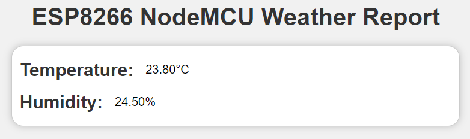
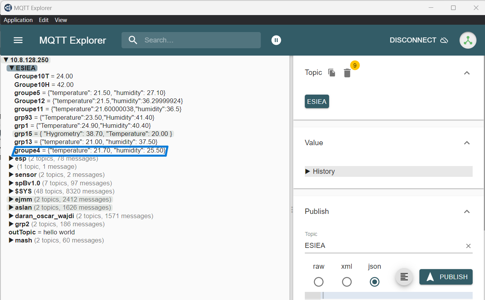
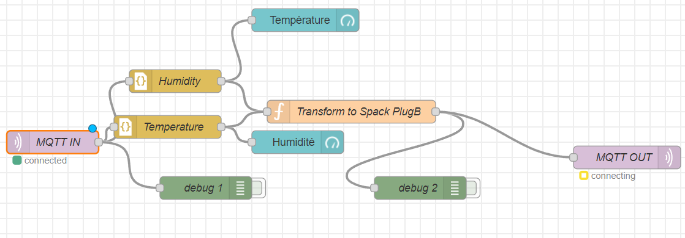
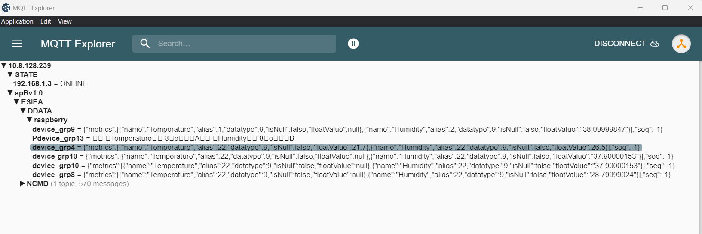

# Rapport MQTT

## Introduction

Ce rapport a pour but de récapituler les différentes étapes de la réalisation du projet. Il est divisé en plusieurs parties :

- [Introduction](#introduction)
- [Présentation du matériel](#présentation-du-matériel)
- [Étapes de réalisation](#étapes-de-réalisation)
    - [Étape 1 : Connexion à l'Arduino](#étape-1-connexion-à-larduino)
    - [Étape 2 : Création du code Arduino](#étape-2-création-du-code-arduino)
    - [Étape 3 : Envoi des données](#étape-3-envoi-des-données)
    - [Étape 4 : Utilisation de Node-RED](#étape-4-utilisation-de-node-red)
    - [Étape 5 : Création d'un dashboard](#étape-5-création-dun-dashboard)
    - [Étape 6 : Ajout de SparkPlugB](#étape-6-ajout-de-sparkplugb)
    - [Étape 7 : Visualisation sur Ignition](#étape-7-visualisation-sur-ignition)
- [Résultats & conclusion](#résultats-conclusion)

## Présentation du matériel

Pour réaliser ce projet, nous avons utilisé les éléments suivants :
- Un Arduino ESP8266
- Un capteur de température et d'humidité DHT22
Le but de ce projet est de récupérer les données du capteur de température et d'humidité et de les envoyer sur un serveur MQTT. Nous avons utilisé Node-RED pour récupérer les données et les afficher sur un dashboard.

## Étapes de réalisation

### Étape 1 : Connexion à l'Arduino

Pour commencer, nous avons connecté le capteur de température et d'humidité au port D2 de l'Arduino. Nous avons également connecté l'Arduino à un ordinateur via un câble USB. Nous avons rencontré quelques problèmes de connexion, mais nous avons finalement réussi à le faire fonctionner en changeant de matériel et en utilisant une plaque d'essai au lieu de connecter directement le capteur à l'Arduino.

### Étape 2 : Création du code Arduino

Nous avons ensuite créé un code Arduino qui permet de récupérer les données du capteur de température et d'humidité. Nous avons utilisé la bibliothèque DHT.h pour récupérer les données du capteur. Nous avons ensuite créé un code qui permet de récupérer les données du capteur et de les envoyer sur un serveur MQTT. Nous avons utilisé la bibliothèque PubSubClient.h pour envoyer les données sur le serveur MQTT.
Nous avons utilisé du code C++ pour créer le code Arduino et utilisé du JSON pour envoyer les données, et avons travaillé sur Visual Studio Code, grâce à l'extension PlatformIO.
Le code Arduino est disponible sur le dépôt GitHub du projet. Nous avons ensuite téléversé le code sur l'Arduino.

### Étape 3 : Envoi des données

Pour commencer nous avons envoyer les premières données sur un webServer hébergé en local avec la bibliothèque ESP8266WebServer.h. Pour l'hébergé sur un réseau local, nous avons utilisé la bibliothèque ESP8266WiFi.h.
Une petite interface web réalisé en HTML et CSS a été créé pour afficher les données.

De plus nous avons testé le code en affichant les données en local, puis une fois le code fonctionnel, on a pu envoyer les données sur le serveur MQTT distant.
Pour envoyer les données sur le serveur MQTT, nous avons utilisé le logiciel MQTT.fx. Nous avons ensuite créé un topic sur le serveur MQTT et envoyé les données sur ce topic. Nous avons ensuite utilisé Node-RED pour récupérer les données du serveur MQTT et les afficher sur un dashboard.
Pour débugger la réception MQTT, nous avons utilisé le logiciel MQTT Explorer.

### Étape 4 : Utilisation de Node-RED

Nous avons ensuite utilisé Node-RED pour récupérer les données du serveur MQTT et les afficher sur un dashboard. Voici les différentes étapes pour récupérer les données :
- Utiliser le bloc MQTT in pour récupérer les données du serveur MQTT
- Utiliser le bloc JSON pour récupérer les données du JSON
- Utiliser le bloc Debug pour afficher les données en local

### Étape 5 : Création d'un dashboard

Nous avons ensuite créé un dashboard pour afficher les données. Nous avons utilisé le bloc Gauge pour afficher les données sur un dashboard. Nous avons ensuite utilisé le bloc Debug pour afficher les données en local.
Nous avons eu besoin d'ajouter la bibliothèque `node-red-dashboard` pour pouvoir utiliser le bloc Gauge. Le dashboard est maintenant fonctionnel et disponible sur l'endpoint `http://localhost:1880/ui`.

### Étape 6 : Ajout de SparkPlugB

Nous avons ensuite ajouté le protocole SparkPlugB pour envoyer les données sur le serveur MQTT. Nous avons utilisé le bloc MQTT out pour envoyer les données sur le serveur MQTT. Ensuite, le bloc fonction a été ajouté pour combiner et transformer les données en format SparkPlugB.
Le flux est maintenant fonctionnel et les données sont visibles sur un nouveau broker sur le serveur MQTT, visible via MQTT Explorer.

### Étape 7 : Visualisation sur Ignition

Ignition a une utilisation a peu près similaire à Node-RED. Il permet aussi de visualiser les données en temps réel. Nous avons donc utilisé Ignition pour récupérer les données du serveur MQTT au format SparkPlugB. Il est important de noté que si les données ne sont pas dans le bon format Ignition ne les affichera pas.  
Le but était d'ajouter une jauge de température et d'humidité.

## Résultats & conclusion

Nous avons réussi à récupérer les données du capteur de température et d'humidité et à les envoyer sur un serveur MQTT. Les données sont ensuite récupérées par Node-RED et affichées sur un dashboard. Les données sont transformées en format SparkPlugB et envoyées sur un nouveau broker sur le serveur MQTT. Ignition récupère ensuite les données du serveur MQTT et les affiche sur un dashboard.
